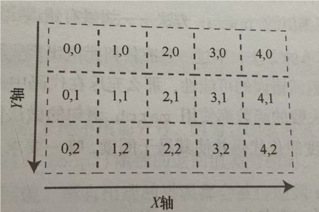

# 3.1 理解游戏循环


`Cargo.toml`:

```toml
[package]
name = "hello_bterm"
version = "0.1.0"
edition = "2021"

[dependencies]
bracket-lib = "~0.8.1"
```

- `~`: `~`表示兼容版本.`~0.8.1`表示`0.8.1`及以上版本,但不包括`0.9.0`

`main.rs`:

```rust
use bracket_lib::prelude::*;

struct State {}

impl GameState for State {
    fn tick(&mut self, ctx: &mut BTerm) {
        ctx.cls();
        ctx.print(1, 1, "Hello, Bracket Terminal!");
    }
}

fn main() -> BError {
    let context = BTermBuilder::simple80x50().
        with_title("Flappy Dragon").build()?;
    main_loop(context, State{})
}
```

- `impl GameState for State {}`: `bracket-lib`这个库要求我们实现一个`GameState` Trait,这个Trait有一个方法`tick()`,这个方法会在**每一帧**被调用
- `fn tick(&mut self, ctx: &mut BTerm){}`: 这里的`ctx`是一个`BTerm`的实例,我们可以通过这个实例与终端交互(获取来自终端的输入、向终端输出等)
- `ctx.cls()`: 清空窗口
- `ctx.print()`: 打印文本
  - 其中前2个参数为坐标

坐标的原点在左上角,向右为x轴正方向,向下为y轴正方向



- `BTermBuilder::simple80x50()`: 创建一个80x50的终端
  - `BTermBuilder::simple()`方法则可以根据给定的宽度和高度创建一个终端,但该方法的返回值为一个Result
  - `BTermBuilder::simple80x50()`方法则直接返回一个`BTermBuilder`实例,不需要处理Result
- `BTermBuilder.with_title()`: 设置窗口标题
- `BTermBuilder.build()`: 创建一个`BTerm`实例.这个实例就是`GameState` Trait中定义的`tick()`方法所要求的`ctx`参数
- `?`: 用于处理Result类型和Option类型的枚举
  - 如果`Result`或`Option`是`Ok`或`Some`的话,`?`会返回`Ok`或`Some`中的值
  - 如果`Result`或`Option`是`Err`或`None`的话,`?`会直接返回`Err`或`None`
  - 注意我们本例中,`main()`函数返回的类型为`BError`,因此可以使用`?`来处理`Result`
- `main_loop()`: 这个函数会一直运行,直到用户关闭窗口
  - 该函数的返回值类型也是`BResult`,和`main()`函数的返回值类型一样,所以在这一行结尾不用加`;`

最终在终端中显示的文字,并非是文本,而是图片.`ctx.print()`会将文本转换为对应的sprite,然后将sprite绘制到终端上

- sprite: 一个小的图形.把小图形叠加到背景图案上的技术,由于图形像精灵一样"悬浮"在背景上,而非嵌入背景中,所以称为sprite