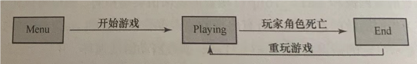

# 3.2 创建不同的游戏模态



## 3.2.1 根据当前模态作出反应

```rust
use bracket_lib::prelude::*;

enum GameMode {
    Menu,
    Playing,
    End,
}

struct State {
    mode: GameMode,
}

impl State {
    fn new() -> Self {
        State {
            // 初始状态为菜单
            mode: GameMode::Menu,
        }
    }

    fn main_menu(&mut self, ctx: &mut BTerm) {

    }

    fn play(&mut self, ctx: &mut BTerm) {
        
    }

    fn dead(&mut self, ctx: &mut BTerm) {

    }
}

impl GameState for State {
    fn tick(&mut self, ctx: &mut BTerm) {
        match self.mode {
            GameMode::Menu => self.main_menu(ctx),
            GameMode::Playing => self.play(ctx),
            GameMode::End => self.dead(ctx),
        }
    }
}

fn main() -> BError {
    let context = BTermBuilder::simple80x50().
        with_title("Flappy Dragon").build()?;
    main_loop(context, State::new())
}
```

## 3.2.2 `play()`函数的桩形式

```rust
impl State {
    fn play(&mut self, ctx: &mut BTerm) {
        // TODO: 游戏逻辑
        self.mode = GameMode::End
    }
}
```

## 3.2.3 主菜单

主菜单要做3件事:

1. 清空屏幕并显示菜单
2. 响应输入
3. 把模态切换为`Playing`,并能够重置游戏状态

```rust
impl State {
    fn main_menu(&mut self, ctx: &mut BTerm) {
        // 清空屏幕 打印菜单
        ctx.cls();
        ctx.print_centered(5, "Welcome to Flappy Dragon");
        ctx.print_centered(8, "(P) Play Game");
        ctx.print_centered(9, "(Q) Quit Game");
        
        if let Some(key) = ctx.key {
            match key { 
                VirtualKeyCode::P => self.mode = GameMode::Playing,
                VirtualKeyCode::Q => ctx.quitting = true,
                _ => {}
            }
        }
    }

    fn restart(&mut self, ctx: &mut BTerm) {
        self.mode = GameMode::Playing;
    }
}
```

- `BTerm.print_centered()`: 使得打印的文本居中显示,第一个参数是y坐标,第二个参数是文本内容
- `ctx.key`: 是一个`Option<VirtualKeyCode>`类型,如果有按键按下,则返回按下的按键,否则返回`None`

这里运作的机制是: `tick()`函数会重复不断地调用`main_manu()`函数,直到用户按下`P`或`Q`键为止

可以试一试以下代码:

```rust
struct State {
    mode: GameMode,
    counter: i64,
}

impl State {
    fn new() -> Self {
        State {
            // 初始状态为菜单
            mode: GameMode::Menu,
            counter: 0,
        }
    }

    fn main_menu(&mut self, ctx: &mut BTerm) {
        // 清空屏幕 打印菜单
        ctx.cls();
        ctx.print_centered(5, "Welcome to Flappy Dragon");
        ctx.print_centered(8, "(P) Play Game");
        ctx.print_centered(9, "(Q) Quit Game");

        if let Some(key) = ctx.key {
            match key {
                VirtualKeyCode::P => self.mode = GameMode::Playing,
                VirtualKeyCode::Q => ctx.quitting = true,
                _ => {}
            }
        }

        self.counter += 1;
        println!("{}", self.counter);
    }
}

impl GameState for State {
    fn tick(&mut self, ctx: &mut BTerm) {
        match self.mode {
            GameMode::Menu => self.main_menu(ctx),
            GameMode::Playing => self.play(ctx),
            GameMode::End => self.dead(ctx),
        }
    }
}

fn main() -> BError {
    let context = BTermBuilder::simple80x50().
        with_title("Flappy Dragon").build()?;
    main_loop(context, State::new())
}

```

```
    Finished `dev` profile [unoptimized + debuginfo] target(s) in 1.62s
     Running `target/debug/flappy_states`
Initialized OpenGL with: 4.1 ATI-4.14.1, Shader Language Version: 4.10
1
2
3
4
...
```

## 3.2.4 游戏结束菜单

和主菜单的功能几乎相同:

```rust
impl State {
    fn dead(&mut self, ctx: &mut BTerm) {
        // 清空屏幕 打印结束菜单
        ctx.cls();
        ctx.print_centered(5, "You are dead!");
        ctx.print_centered(8, "(P) Play Again");
        ctx.print_centered(9, "(Q) Quit Game");

        if let Some(key) = ctx.key {
            match key {
                VirtualKeyCode::P => self.mode = GameMode::Playing,
                VirtualKeyCode::Q => ctx.quitting = true,
                _ => {}
            }
        }
    }
}
```