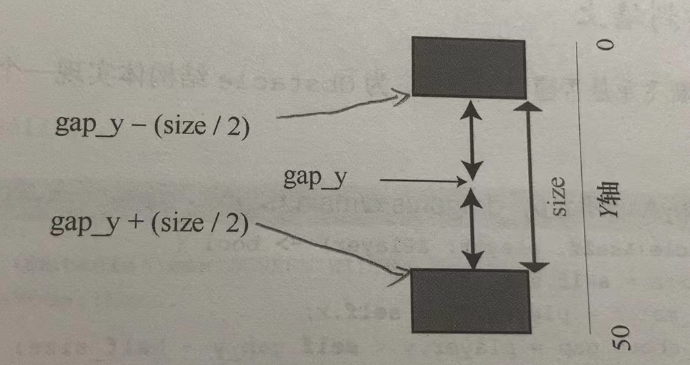

# 3.4 创建障碍物并实现计分逻辑

```rust
struct Obstacle {
    x: i32,
    // 缺口中心位置的y坐标
    gap_y: i32,
    // 缺口大小
    size: i32,
}

impl Obstacle {
    fn new(x: i32, score: i32) -> Self {
        let mut random = RandomNumberGenerator::new();
        Obstacle {
            x,
            gap_y: random.range(10, 40),
            size: i32::max(2, 20 - score)
        }
    }
}
```

## 3.4.1 渲染障碍物

- 世界坐标系: 世界坐标系用于表示物体在游戏世界中的绝对位置,通常在一个比较大的范围内使用
  - 本例中,`Player.x`记录的就是世界坐标系中的玩家水平位置
- 屏幕坐标系: 屏幕坐标系用于表示物体在屏幕上的位置,通常在一个比较小的范围内使用
  - 本例中,`Player.y`记录的就是屏幕坐标系中的玩家垂直位置

- 障碍物在屏幕坐标系下的水平位置: `障碍物的世界坐标系水平位置 - 玩家的世界坐标系水平位置`



- 障碍物的上半部分: 从0开始,到`gap_y - size/2`
- 障碍物的下半部分: 从`gap_y + size/2`到`屏幕高度`(即`SCREEN_HEIGHT`)

```rust
impl Obstacle {
    fn render(&mut self, ctx: &mut BTerm, player_x: i32) {
        // 计算障碍物在屏幕上的水平位置
        let screen_x = self.x - player_x;
        
        let half_size = self.size / 2;
        // 绘制障碍物的上半部分
        for y in 0.. self.gap_y - half_size {
            ctx.set(screen_x, y, RED, BLACK, to_cp437('|'));
        }
        // 绘制障碍物的下半部分
        for y in self.gap_y + half_size .. SCREEN_HEIGHT {
            ctx.set(screen_x, y, RED, BLACK, to_cp437('|'));
        }
    }
}
```

## 3.4.2 一头撞到墙上

这个逻辑比较简单:

- 在玩家和障碍物的水平坐标相同(本例中我们使用的是世界坐标系)的前提下:
  - 若玩家的垂直屏幕坐标小于障碍物的上半部分 或 大于障碍物的下半部分时
  - 则玩家与障碍物发生碰撞

```rust
impl Obstacle {
    fn hit_obstacle(&self, player: &Player) -> bool {
        let half_size = self.size / 2;
        let does_x_match = player.x == self.x;
        let player_above_gap = player.y < self.gap_y - half_size;
        let player_bellow_gap = player.y > self.gap_y + half_size;
        does_x_match && (player_above_gap || player_bellow_gap)
    }
}
```

## 3.4.3 记录得分和障碍物状态

```rust
struct State {
    player: Player,
    // 帧与帧之间的时间间隔 以毫秒为单位
    frame_time: f32,
    obstacle: Obstacle,
    mode: GameMode,
    score: i32,
}

impl State {
    fn new() -> Self {
        State {
            player: Player::new(5, 25),
            frame_time: 0.0,
            // 初始化障碍物: 第1个障碍物的世界坐标x为SCREEN_WIDTH 
            // 后续障碍物的世界x坐标为: 玩家当前的世界x坐标 + SCREEN_WIDTH
            obstacle: Obstacle::new(SCREEN_WIDTH, 0),
            // 初始状态为菜单
            mode: GameMode::Menu,
            score: 0,
        }
    }
}
```

## 3.4.4 在`play()`函数中加入障碍物和计分逻辑

- 玩家每越过一个障碍物,则:
  - 得分+1
  - 创建一个新的障碍物
- 同时,判断游戏结束的条件,除了玩家坠落到地面外,还有玩家撞到障碍物

```rust
impl State {
  fn play(&mut self, ctx: &mut BTerm) {
    // 清空屏幕
    ctx.cls_bg(NAVY);

    // 计算玩家受重力影响在位置上的改变
    self.frame_time += ctx.frame_time_ms;
    if self.frame_time > FRAME_DURATION {
      self.player.gravity_and_move();
      self.frame_time = 0.0;
    }

    // 计算玩家主动扇动翅膀在位置上的改变
    if let Some(VirtualKeyCode::Space) = ctx.key {
      self.player.flap();
    }

    // 渲染玩家
    self.player.render(ctx);
    ctx.print(0, 0, "Press SPACE to flap.");
    ctx.print(0, 1, &format!("Frame Time: {}", ctx.frame_time_ms));
    ctx.print(0, 2, &format!("FPS: {}", ctx.fps));
    ctx.print(0, 3, &format!("Speed: {}", self.player.velocity));
    ctx.print(0, 4, &format!("Score: {}", self.score));

    // 渲染障碍物
    self.obstacle.render(ctx, self.player.x);

    // 玩家穿过了一个障碍物 则得分+1 并创建一个新的障碍物(基于玩家当时的世界坐标x创建)
    if self.player.x > self.obstacle.x {
      self.score += 1;
      self.obstacle = Obstacle::new(self.player.x + SCREEN_WIDTH, self.score);
    }

    // 判断游戏是否结束
    // Tips: 注意,这里的self.obstacle不是上边穿过障碍物后重新创建的self.obstacle
    // 而是在上边的self.obstacle.render(ctx, self.player.x);中渲染的self.obstacle
    // 这里的逻辑是: 只有当玩家成功穿越了上一个障碍物,才会创建一个新的障碍物
    // 所以这里判断玩家是否撞到的障碍物是上一个障碍物 也就是在 self.player.x <= self.obstacle.x
    // 这个条件下的障碍物
    if self.player.y > SCREEN_HEIGHT || self.obstacle.hit_obstacle(&self.player) {
      self.mode = GameMode::End;
    }
  }
}
```

## 3.4.5 将得分显示在游戏结束画面上

```rust
impl State {
  fn dead(&mut self, ctx: &mut BTerm) {
    // 清空屏幕 打印结束菜单
    ctx.cls();
    ctx.print_centered(5, "You are dead!");
    ctx.print_centered(8, "(P) Play Again");
    ctx.print_centered(9, "(Q) Quit Game");
    ctx.print_centered(10, &format!("Score: {}", self.score));

    if let Some(key) = ctx.key {
      match key {
        VirtualKeyCode::P => self.mode = GameMode::Playing,
        VirtualKeyCode::Q => ctx.quitting = true,
        _ => {}
      }
    }
  }
}
```

## 3.4.6 在重玩游戏时重置得分和障碍物

```rust
impl State {
  fn main_menu(&mut self, ctx: &mut BTerm) {
    // 清空屏幕 打印欢迎菜单
    ctx.cls();
    ctx.print_centered(5, "Welcome to Flappy Dragon");
    ctx.print_centered(8, "(P) Play Game");
    ctx.print_centered(9, "(Q) Quit Game");

    if let Some(key) = ctx.key {
      match key {
        VirtualKeyCode::P => self.restart(),
        VirtualKeyCode::Q => ctx.quitting = true,
        _ => {}
      }
    }
  }

  fn dead(&mut self, ctx: &mut BTerm) {
    // 清空屏幕 打印结束菜单
    ctx.cls();
    ctx.print_centered(5, "You are dead!");
    ctx.print_centered(8, "(P) Play Again");
    ctx.print_centered(9, "(Q) Quit Game");
    ctx.print_centered(10, &format!("Score: {}", self.score));

    if let Some(key) = ctx.key {
      match key {
        VirtualKeyCode::P => self.restart(),
        VirtualKeyCode::Q => ctx.quitting = true,
        _ => {}
      }
    }
  }
  
  fn restart(&mut self) {
    self.player = Player::new(5, 25);
    self.frame_time = 0.0;
    self.obstacle = Obstacle::new(SCREEN_WIDTH, 0);
    self.mode = GameMode::Playing;
    self.score = 0;
  }
}
```